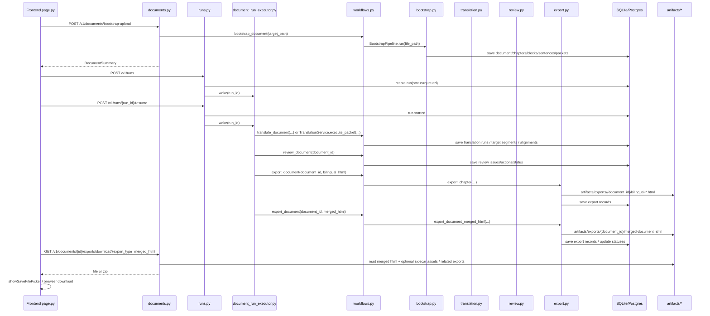

# Upload To HTML Call Chain

更新时间：2026-03-17

这份文档梳理当前系统从“前端选择 `.epub/.pdf` 文件上传”到“最终 HTML 导出物写入指定目录并供前端下载”的完整调用链路，目标是为后续分析、排障和重构提供稳定入口。

本文覆盖两条主路径：

- 前端一键自动链路：上传后自动创建 `translate_full` run，后台依次执行 `translate -> review -> bilingual_html -> merged_html`
- 已落库文档的手动/历史链路：直接复用已有文档、run、章节与导出记录，不重复消耗 translation token

## 1. 总览

## 2. 应用级目录与运行时上下文

应用启动点在 `src/book_agent/app/main.py`：

- `app.state.session_factory`
- `app.state.export_root`
- `app.state.upload_root`
- `app.state.translation_worker`
- `app.state.document_run_executor`

默认配置在 `src/book_agent/core/config.py`：

- `api_prefix = "/v1"`
- `export_root = artifacts/exports`
- `upload_root = artifacts/uploads`

这意味着当前默认的物理目录布局是：

- 上传暂存：`artifacts/uploads/<uuid>/<filename>`
- 导出产物：`artifacts/exports/<document_id>/...`

`main.py` 的 `startup` 钩子会调用 `ensure_document_run_executor(app)`，后台线程执行器因此在 API 进程启动后即可接管 `translate_full` run。

## 3. 前端入口：从文件选择到自动启动 run

前端主入口在 `src/book_agent/app/ui/page.py`。

### 3.1 上传与 bootstrap

`bootstrapDocument(event)` 的顺序是：

1. 从文件选择器读取 `.epub` 或 `.pdf`
2. 组装 `FormData`
3. 调用 `fetchMultipartJson(apiPrefix + "/documents/bootstrap-upload", formData)`
4. 收到 `DocumentSummary` 后写入当前 `document_id`
5. 立刻调用 `createRunForDocument(document_id, ...)`
6. 调用 `trackAutoPipeline(run_id, document_id, true)`
7. 刷新文档摘要、导出面板、worklist、history

`createRunForDocument()` 会：

- `POST /v1/runs`
- payload 固定 `run_type = "translate_full"`
- 在 `status_detail_json.pipeline.stages` 里预填：
  - `translate`
  - `review`
  - `bilingual_html`
  - `merged_html`
- 随后再调用 `POST /v1/runs/{run_id}/resume`

### 3.2 自动感知进度与自动下载

`handleAutoPipelineSummary(summary)` 是前端自动链路的收口：

- 当 run `succeeded`：
  - 刷新文档与历史记录
  - 如果 `autoDownloadOnSuccess = true`，自动调用 `downloadCurrentExport(document_id, "merged_html")`
- 当 run `failed / paused / cancelled`：
  - 停止自动链路
  - 在 banner 显示 stop reason

### 3.3 手动操作入口

`runDocumentAction(action)` 支持直接调用：

- `POST /v1/documents/{document_id}/translate`
- `POST /v1/documents/{document_id}/review`
- `POST /v1/documents/{document_id}/export`

`export` 支持：

- `export_type`
- `auto_execute_followup_on_gate`
- `max_auto_followup_attempts`

这条手动链路和自动 run 最终都会落到同一套 `DocumentWorkflowService` / `ExportService` 上。

## 4. 上传 API：文件如何进入系统

API 路由在 `src/book_agent/app/api/routes/documents.py`。

### 4.1 `POST /v1/documents/bootstrap-upload`

`bootstrap_uploaded_document()` 的行为：

1. 使用 `_safe_upload_filename()` 校验扩展名，只允许 `.epub/.pdf`
2. 取 `_upload_root(request)`
3. 创建 `artifacts/uploads/<uuid>/`
4. 将 `UploadFile` 内容写入目标路径
5. 调用 `_workflow_service(request, session).bootstrap_document(target_path)`
6. 出错时清理已写入文件

这里的 `_workflow_service()` 会把 `request.app.state.export_root` 和 `translation_worker` 注入 `DocumentWorkflowService`，所以所有后续服务都共享同一套运行时配置。

### 4.2 `POST /v1/documents/bootstrap`

这是本地路径版本，直接接 `source_path`，适合脚本或本机开发，不经过 multipart 上传。

## 5. Bootstrap：从原始文件到持久化文档契约

`DocumentWorkflowService.bootstrap_document()` 位于 `src/book_agent/services/workflows.py`：

1. 调用 `BootstrapPipeline().run(source_path)`
2. 将产物交给 `BootstrapRepository.save(artifacts)`
3. 返回 `get_document_summary(document_id)`

### 5.1 BootstrapPipeline 组成

定义在 `src/book_agent/services/bootstrap.py` 的 `BootstrapPipeline.run()`：

1. `IngestService.ingest(file_path)`
   - 计算文件指纹
   - 识别 `SourceType`
   - 生成初始 `Document` 和 `INGEST` job
2. `ParseService.parse(document, file_path)`
   - EPUB 走 `EPUBParser`
   - PDF 走 `PDFParser`
   - 更新 `Document.title/author/metadata/status`
   - 生成 `Chapter` 和 `Block`
3. `SegmentationService.segment(...)`
   - 将 block 切成 `Sentence`
   - 写入 translatability / initial sentence status
4. `BookProfileBuilder.build(...)`
   - 生成全书 profile / termbase / entity registry
5. `ChapterBriefBuilder.build_many(...)`
   - 为章节生成 brief memory
6. `ContextPacketBuilder.build_many(...)`
   - 生成 `TranslationPacket` 和 `PacketSentenceMap`
7. 将 `Document.status` 推到 `ACTIVE`
8. 将 `Chapter.status` 推到 `PACKET_BUILT`

### 5.2 Bootstrap 持久化内容

`BootstrapRepository.save()` 会顺序 merge 并 flush：

- `Document`
- `Chapter`
- `Block`
- `Sentence`
- `BookProfile`
- `MemorySnapshot`
- `TranslationPacket`
- `PacketSentenceMap`
- `JobRun`

这一步非常关键：一旦 bootstrap 完成，结构恢复、句子切分、packet 构建都已经落库。后续如果只是 `review/export` 出问题，不应重新 bootstrap，更不应重新翻译。

## 6. Run 创建与后台调度

### 6.1 API 层

`src/book_agent/app/api/routes/runs.py`：

- `POST /v1/runs`
- `POST /v1/runs/{run_id}/resume`
- `POST /v1/runs/{run_id}/retry`
- `POST /v1/runs/{run_id}/pause|drain|cancel`
- `GET /v1/runs/{run_id}`
- `GET /v1/runs/{run_id}/events`

`create_run()` 和所有 control action 在成功后都会调用 `_wake_executor(request, run_id)`，唤醒后台执行器。

### 6.2 RunControlService

`src/book_agent/services/run_control.py`：

- `create_run()` 创建 queued run
- `resume_run()` 将 queued/paused run 变成 running
- `retry_run()` 会复制旧 run 的：
  - `document_id`
  - `run_type`
  - `backend`
  - `model_name`
  - `priority`
  - `budget`
  - `status_detail_json`
- 新 run 会写入 `resume_from_run_id`

这意味着 history 重试不会丢上下文，也不会创建一份新的 document。

## 7. 后台执行器：`translate_full` 的真实阶段顺序

`src/book_agent/app/runtime/document_run_executor.py` 是自动链路的核心。

### 7.1 线程模型

- supervisor 线程扫描所有：
  - `run_type == TRANSLATE_FULL`
  - `status in (RUNNING, DRAINING)`
- 每个 run 启一个 run thread
- run thread 固定按顺序处理：
  1. translate
  2. review
  3. export bilingual_html
  4. export merged_html
  5. reconcile terminal state

### 7.2 translate 阶段

`_process_translate_stage(run_id)`：

1. 若没有 translate work item，则根据 `TranslationPacket.status == BUILT` 为当前文档 seed work items
2. claim 下一个 translate work item
3. `_execute_translate_work_item()` 最终调用 `_translate_single_packet(packet_id)`
4. `_translate_single_packet()` 进入 `DocumentWorkflowService.translation_service.execute_packet(packet_id)`

### 7.3 review 阶段

`_process_review_stage(run_id)`：

1. 等所有 translate work item `SUCCEEDED`
2. seed 一个 `scope_type = DOCUMENT` 的 review work item
3. `_execute_review_work_item()` 调用 `workflow.review_document(document_id)`

### 7.4 export 阶段

`_process_export_stage(run_id, export_type)`：

- `bilingual_html` 必须等 review 成功
- `merged_html` 必须等 bilingual_html 成功
- 每个 export type 只 seed 一个 `scope_type = EXPORT` work item
- `_execute_export_work_item()` 调用：
  - `workflow.export_document(document_id, ExportType.BILINGUAL_HTML, auto_execute_followup_on_gate=True, ...)`
  - 或 `workflow.export_document(document_id, ExportType.MERGED_HTML, auto_execute_followup_on_gate=True, ...)`

这里的关键点是：自动 run 默认开启 `auto_execute_followup_on_gate=True`，因此 export gate 如果附带 planned follow-up action，会优先自动执行，而不是直接 hard fail。

## 8. 翻译、审校、导出的核心服务链

### 8.1 翻译

`src/book_agent/services/translation.py` 的 `TranslationService.execute_packet(packet_id)`：

1. `TranslationRepository.load_packet_bundle(packet_id)`
2. 调用 `TranslationWorker.translate(TranslationTask(...))`
3. 生成：
   - `TranslationRun`
   - `TargetSegment`
   - `AlignmentEdge`
   - 更新后的 `Sentence`
4. `save_translation_artifacts(...)`
5. 将 `TranslationPacket.status` 更新为 `TRANSLATED`

这意味着 token 主要消耗在 packet translation 阶段。后续 review/export 都是读库重算或重渲染。

### 8.2 审校

`DocumentWorkflowService.review_document(document_id)`：

1. 从 bootstrap repository 读取 document bundle
2. 对每个 chapter：
   - 仅当该 chapter 的 packet 都已 `TRANSLATED` 才进入 review
   - 调用 `ReviewService.review_chapter(chapter_id)`
3. 写回：
   - `ReviewIssue`
   - `IssueAction`
   - `ChapterQualitySummary`
   - `Chapter.status`

### 8.3 导出

`DocumentWorkflowService.export_document(document_id, export_type, ...)`：

1. 先对每个章节调用 `export_service.assert_chapter_exportable()`
2. 如果触发 `ExportGateError`：
   - 可选自动执行 follow-up action
   - 然后重新进入 gate 检查
3. 若 `export_type == MERGED_HTML`：
   - 调用 `ExportService.export_document_merged_html(document_id)`
4. 否则：
   - 遍历章节调用 `ExportService.export_chapter(chapter_id, export_type)`

## 9. ExportService：HTML 文件如何写入指定目录

`src/book_agent/services/export.py`

### 9.1 目录规则

`ExportService.__init__(output_root="artifacts/exports")`

所有导出都写到：

- `artifacts/exports/<document_id>/`

### 9.2 chapter bilingual HTML

`export_chapter(chapter_id, ExportType.BILINGUAL_HTML)`：

- 输出：
  - `bilingual-<chapter_id>.html`
  - `bilingual-<chapter_id>.manifest.json`
- 如果是 EPUB 且 block metadata 带资源引用，还会把 sidecar 资源导出到：
  - `artifacts/exports/<document_id>/assets/...`

### 9.3 merged HTML

`export_document_merged_html(document_id)`：

- 输出：
  - `merged-document.html`
  - `merged-document.manifest.json`
- 对整本文档统一调用 `_export_epub_assets_for_document_bundle(...)`
- 记录 `Export` 表
- 更新文档/章节导出状态

### 9.4 文件名与导出记录

Export 物理文件名是固定的，但数据库里仍会记录：

- `document_id`
- `export_type`
- `status`
- `file_path`
- `manifest_path`
- `input_version_bundle_json`

因此只要 DB 还在，HTML 产物就可以被 history、download、dashboard 重新发现，不需要重新翻译。

## 10. 下载链路：前端如何拿到最终产物

### 10.1 当前文档下载

前端：

- `downloadCurrentExport(documentId, exportType)`
- `downloadChapterExport(documentId, chapterId, exportType="bilingual_html")`

后端：

- `GET /v1/documents/{document_id}/exports/download`
- `GET /v1/documents/{document_id}/chapters/{chapter_id}/exports/download`

### 10.2 下载打包规则

`documents.py` 的归档辅助函数：

- `_export_sidecar_paths(file_path)`：HTML 旁边如果有 `assets/`，一并打包
- `_build_export_archive(...)`：把主文件和 sidecar 文件打成 zip
- `_preferred_archive_name(...)`：尽量保留记录中的原始文件名

具体行为：

- 单个文件且没有 sidecar：直接返回该文件
- chapter bilingual HTML + assets：返回 zip
- merged_html 下载：除了 merged 本体，还会把所有成功的 chapter bilingual exports 一并打进 zip，文件名形如：
  - `<document_id>-analysis-bundle.zip`

这就是为什么前端“下载 merged_html”实际上拿到的是完整分析归档，而不是只有一个 HTML 文件。

## 11. 历史记录与重试：如何避免重复消耗 token

历史页面相关数据来自：

- `GET /v1/documents/history`
- `GET /v1/documents/{document_id}`
- `GET /v1/runs/{run_id}`
- `GET /v1/runs/{run_id}/events`

前端 `Retry run` 会调用：

- `POST /v1/runs/{run_id}/retry`

### 11.1 低成本重跑原则

重构或排障时，优先采用下面顺序：

1. **只重导出**
   - 适用：HTML 样式、段落拼接、manifest、下载打包问题
   - 调用：
     - `POST /v1/documents/{document_id}/export`
2. **重 review + 导出**
   - 适用：chapter status、gate、issue/action 已变化
   - 调用：
     - `POST /v1/documents/{document_id}/review`
     - 再 `export`
3. **只重试 failed run**
   - 适用：旧 run 中途断在 review/export，translation 已基本完成
4. **最后才重新翻译**
   - 仅当 packet 仍是 `BUILT`、translation artifacts 缺失、或 planned action 明确要求 rerun packet

原因是系统已经把以下高价值中间结果落库：

- 解析结构：`Document / Chapter / Block / Sentence`
- 记忆与 packet：`BookProfile / MemorySnapshot / TranslationPacket / PacketSentenceMap`
- 翻译结果：`TranslationRun / TargetSegment / AlignmentEdge`
- 审校结果：`ReviewIssue / IssueAction / ChapterQualitySummary`
- 导出结果：`Export`

只要这些记录还在，绝大多数问题都可以通过 `review/export` 修复，而不必重新消耗 provider token。

## 12. 当前主链路的重构边界

后续如果要重构，这几个边界最重要：

### 12.1 前端 orchestration 与后端 orchestration 混合

当前“自动一键流程”是前端先：

- bootstrap
- create run
- resume run

然后后台再负责四阶段执行。优点是实现快，缺点是上传和 run 创建是两步 API，不是一个真正原子事务。

### 12.2 `translate_full` 只是一种后台编排约定

执行顺序硬编码在 `DocumentRunExecutor._run_loop()` 里。想要未来支持：

- `paper_html`
- `review_package`
- PDF 专用导出
- 多分支导出策略

最好把阶段图从代码 if/else 抽成显式 state machine 配置。

### 12.3 export gate 与 auto-followup 已经是关键控制面

当前 export 不是简单“写文件”，而是：

- 先 gate
- 可自动执行 follow-up action
- 再重试导出

后续如果重构导出层，不能丢掉这个控制面，否则历史问题会再次回到“review 成功但 export terminal fail”。

### 12.4 文件系统只是最终投影，数据库才是事实来源

历史、下载、重试、dashboard 都依赖数据库记录的：

- run 状态
- review 结果
- export 记录

不要把“HTML 是否存在”当成唯一事实来源；正确的判断应是“DB 记录 + 文件解析成功”。

## 13. 关键文件索引

### 前端

- `src/book_agent/app/ui/page.py`

### API

- `src/book_agent/app/api/routes/documents.py`
- `src/book_agent/app/api/routes/runs.py`

### 应用启动与运行时

- `src/book_agent/app/main.py`
- `src/book_agent/app/runtime/document_run_executor.py`

### 核心服务

- `src/book_agent/services/bootstrap.py`
- `src/book_agent/services/workflows.py`
- `src/book_agent/services/translation.py`
- `src/book_agent/services/review.py`
- `src/book_agent/services/export.py`
- `src/book_agent/services/run_control.py`

### 仓储

- `src/book_agent/infra/repositories/bootstrap.py`
- `src/book_agent/infra/repositories/export.py`

## 14. 当前结论

当前系统的真实主链路可以概括为：

1. 前端上传文件到 `artifacts/uploads`
2. 后端 bootstrap 并把结构、句子、packet、memory 全量落库
3. 前端创建并启动 `translate_full` run
4. 后台执行器按 `translate -> review -> bilingual_html -> merged_html` 顺序推进
5. 导出文件写入 `artifacts/exports/<document_id>/`
6. 下载接口按需要返回单文件或 zip 归档
7. 历史记录和重试复用同一 document/run/export 事实，不必重复翻译

因此，后续分析或重构时，应该把系统看成三层：

- **结构与翻译事实层**：数据库
- **编排执行层**：run control + executor + workflow
- **交付物层**：HTML/manifest/assets/zip

三层边界一旦分清，后续无论是接 PDF 论文保真导出，还是重做前端任务驾驶舱，都不需要重新追整条链路。
